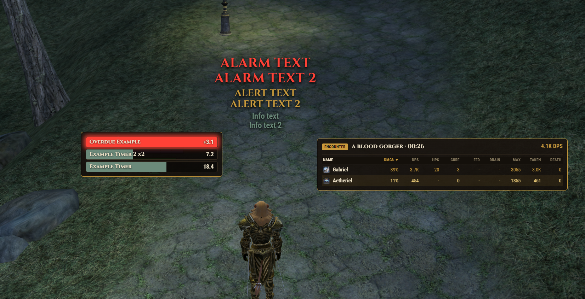
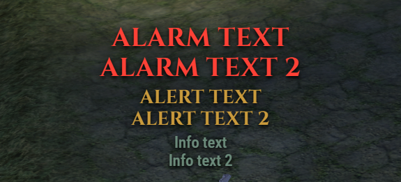
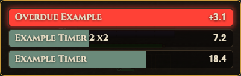
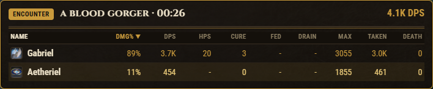
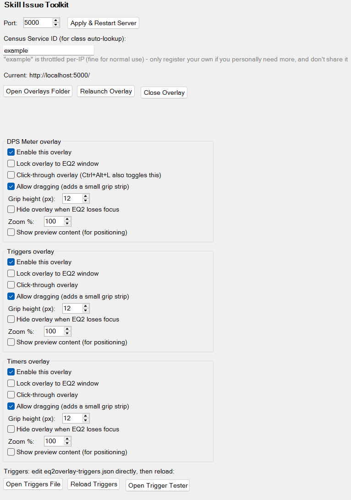

# Skill Issue Toolkit

A combat overlay, trigger/alert system, and countdown timers for EverQuest 2, built on
[Advanced Combat Tracker (ACT)](https://advancedcombattracker.com/).



## Why

EQ2 doesn't have anything like [Cactbot](https://github.com/quisquous/cactbot) or
[OverlayPlugin](https://github.com/OverlayPlugin/OverlayPlugin) - the trigger, timer, and
DPS-meter overlays that FFXIV players take for granted. Skill Issue Toolkit brings that
same idea to EQ2: a real-time DPS meter, regex-based trigger alerts, and countdown timer
bars, all rendered as transparent always-on-top windows over the game instead of a
separate browser tab, spreadsheet or Windows 95 looking window.

## What it does

- **DPS meter** - per-encounter damage, DPS, healing, HPS, power fed/drained, max hit,
  cures, and deaths for every ally in the fight, with automatic class icons.
- **Trigger alerts** - regex-matched log-line alerts in three severity tiers (Alarm,
  Alert, Info), with built-in triggers that auto-update from this repo so you always have
  the latest set without redistributing files, plus your own custom triggers on top.
- **Timer bars** - countdown bars for recurring abilities, driven by the same trigger
  rules, with automatic stacking when multiple instances are active at once.

| Trigger alerts | Timer bars |
|---|---|
|  |  |

| DPS meter | Settings |
|---|---|
|  |  |

## How it works

```
EQ2 game
   │
   ▼
ACT + EQ2 parsing plugin
   ▼
SkillIssueToolkit.ActPlugin - reads ACT's combat data, runs an HTTP+WebSocket server
   ▼
SkillIssueToolkit.Overlay.exe - one transparent, always-on-top window per overlay page
```

## Installation

1. Install [Advanced Combat Tracker](https://advancedcombattracker.com/) and get it
   parsing EQ2 combat logs.
2. Download the latest release from the [Releases](../../releases) page and unzip it
   somewhere.
3. In ACT: **Plugins** tab → **Browse** → select `SkillIssueToolkit.ActPlugin.dll` →
   **Add/Enable Plugin**.
4. The overlay windows appear automatically over the game. Reposition them from ACT's
   settings tab for this plugin (see below).

## Configuring

Every overlay is configured from its own labeled group in ACT's settings tab for this
plugin:

- **Enable/disable** each overlay independently, live, no relaunch needed.
- **Lock to EQ2 window** so the overlay follows the game window's position.
- **Click-through** so mouse clicks pass through to the game underneath.
- **Allow dragging** to reposition an overlay without turning off click-through first.
- **Zoom** to resize an overlay's content.
- **Hide when EQ2 loses focus** to auto-hide on alt-tab.

Trigger rules can be reviewed and individually disabled from the same settings tab, and
your own custom triggers live in a plain JSON file you can edit directly. See
[`ActPlugin/README.md`](ActPlugin/README.md) for full details on triggers, timers, and
class-icon lookup.

## Building from source

```
.\publish.ps1
```

Builds both projects and assembles a distributable folder under `dist/`. See
[`ActPlugin/README.md`](ActPlugin/README.md) and [`Overlay/README.md`](Overlay/README.md)
for project-level details.
